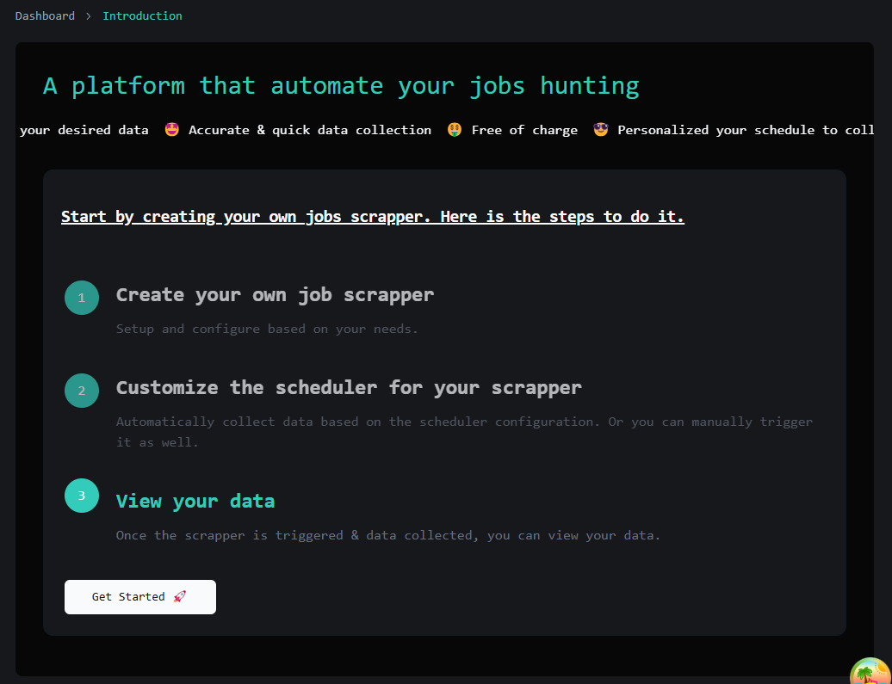
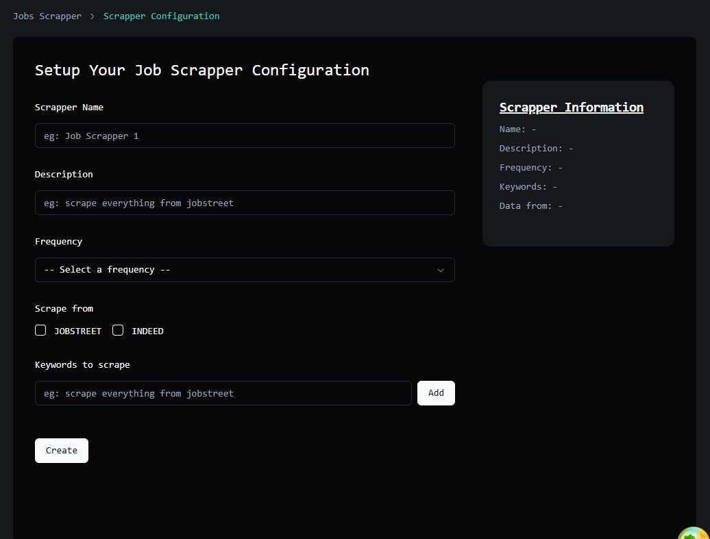
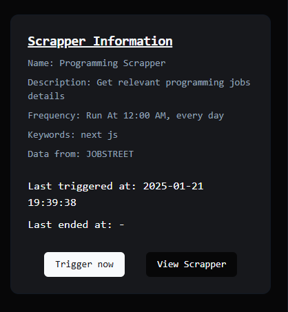
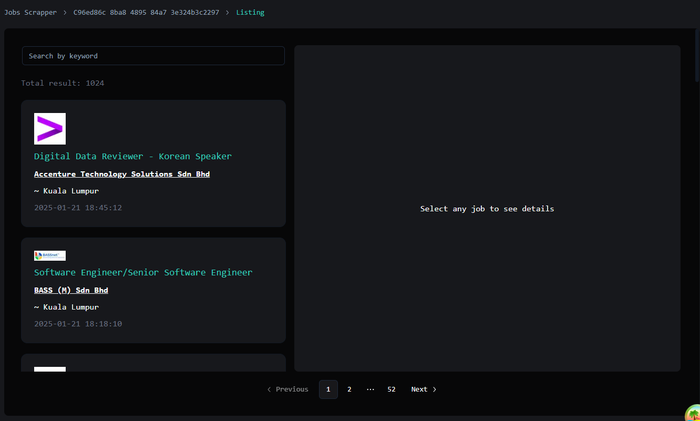
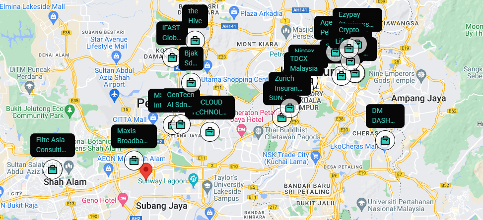

# Personalized Job Scheduler and Map Visualization

This project aims to enhance job search efficiency by allowing users to create personalized schedulers to collect (scrape) data from multiple job platforms. It leverages various frameworks and techniques such as Next.js, Node.js with Express, AWS, Tailwind, shadcn, and primarily Nx monorepo.

## Built With

- **Monorepo Management**:
  - <a href="https://github.com/nrwl/nx" target="_blank">Nx -Smart Monorepos</a>
- **Front-end**:
  - Next.js
  - Tailwind CSS
  - React Query
  - Zustand
  - <a href="https://ui.shadcn.com/" target="_blank">Shadcn/ui</a>
- **Back-end**:
  - Node.js
  - Express.js
- **Infrastructure**:
  - AWS Lambda
  - AWS S3
  - AWS SQS
  - AWS EventBridge
- **Database**:
  - Postgresql with <a href="tembo.io" target="_blank">tembo.io</a>
- **Auth**:
  - Custom auth with JWT refresh token

## Project Features

- **Personalized Scheduler**: Allows users to create custom schedules for scraping data from various job platforms.
- **Data Collection**: Scrapes job data from multiple platforms to overcome the limitations of standard search engines.
- **Map Visualization**: Displays collected company data on an interactive map.
- **Nx Monorepo**: Utilizes Nx to manage a monorepo with multiple frameworks and services.

## Guide

Follow these steps to automate your job hunting experience:

1. **Create a new account and login to introduction page**:
   

2. **Get started by creating a scheduler**
   

3. **Either wait for the automation to trigger or trigger manually to collect the data**
   

4. **After triggering the scrapper, wait for a moment for the data to be inserted. And finally utilise the job filtering and map visualization features!**
   
   

## Disclaimer

**_This is just experimental project (for me to learn). The UI might look quite crappy_ :D**

- 
- But these is what i have learned:
  - Nx Monorepos
  - AWS Serverless Application
  - Github actions - CI/CD workflows
